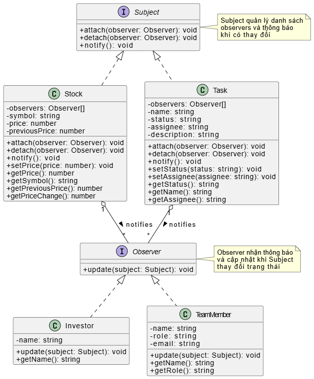
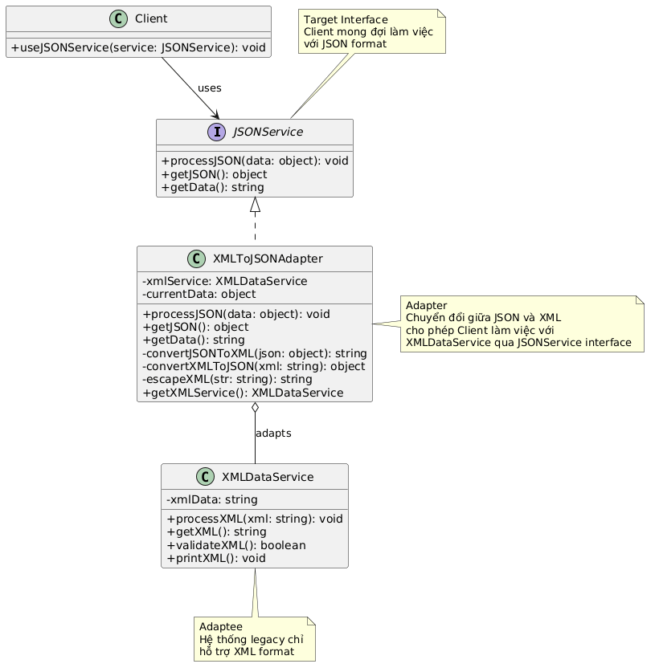

# Bài thực hành tuần 3 - Design Patterns

## Mô tả

Triển khai các Design Pattern phổ biến trong lập trình hướng đối tượng:

### Phần 1: Patterns cơ bản

1. **Observer Pattern** - Hệ thống thông báo tự động (Stock Market & Task Management)
2. **Adapter Pattern** - Chuyển đổi dữ liệu JSON/XML

### Phần 2: Hệ thống quản lý thư viện (Library Management System)

**Bài tập chính:** Thiết kế hệ thống quản lý thư viện sử dụng 5 Design Patterns:

3. **Singleton Pattern** - Quản lý instance duy nhất của thư viện
4. **Factory Method Pattern** - Tạo các loại sách khác nhau (Physical, Digital, Audio)
5. **Strategy Pattern** - Các chiến lược tìm kiếm sách khác nhau
6. **Observer Pattern** - Hệ thống thông báo cho nhân viên và người dùng
7. **Decorator Pattern** - Mở rộng chức năng mượn sách với các dịch vụ bổ sung

## Công nghệ sử dụng

- **Ngôn ngữ**: TypeScript
- **Runtime**: Node.js
- **Build tool**: TypeScript Compiler (tsc)
- **Package manager**: npm

## Cấu trúc thư mục

```
.
├── images/                     # Sơ đồ UML (PNG)
│   ├── observer.png           # Observer Pattern UML
│   └── adapter.png            # Adapter Pattern UML
│
├── diagrams/                   # PlantUML source files
│   ├── observer-class-diagram.puml
│   ├── observer-sequence-diagram.puml
│   ├── adapter-class-diagram.puml
│   └── adapter-sequence-diagram.puml
│
├── src/
│   ├── observer/               # Observer Pattern (Stock Market & Tasks)
│   │   ├── interfaces.ts
│   │   ├── Stock.ts
│   │   ├── Investor.ts
│   │   ├── Task.ts
│   │   ├── TeamMember.ts
│   │   ├── demo.ts
│   │   ├── stock-market-demo.ts
│   │   └── STOCK-MARKET-README.md
│   │
│   ├── adapter/                # Adapter Pattern (JSON/XML)
│   │   ├── JSONService.ts
│   │   ├── XMLDataService.ts
│   │   ├── XMLToJSONAdapter.ts
│   │   └── demo.ts
│   │
│   └── library/                # Library Management System
│       ├── interfaces/         # Core interfaces
│       │   └── index.ts
│       ├── models/             # Base models
│       │   └── index.ts
│       ├── patterns/           # Design Patterns implementation
│       │   ├── singleton/      # Singleton Pattern
│       │   │   └── Library.ts
│       │   ├── factory/        # Factory Method Pattern
│       │   │   └── BookFactory.ts
│       │   ├── strategy/       # Strategy Pattern
│       │   │   └── SearchStrategy.ts
│       │   ├── observer/       # Observer Pattern
│       │   │   └── LibraryObserver.ts
│       │   └── decorator/      # Decorator Pattern
│       │       └── BorrowDecorator.ts
│       ├── demo/               # Comprehensive demo
│       │   └── LibraryDemo.ts
│       └── index.ts            # Main exports
│
├── package.json
├── tsconfig.json
└── README.md
```

## Cài đặt

### 1. Clone hoặc tải project

### 2. Cài đặt dependencies

```bash
npm install
```

### 3. Build project (optional)

```bash
npm run build
```

## Chạy Demo

### Phần 1: Observer & Adapter Patterns

#### Observer Pattern - Stock & Task Notification

**Demo đầy đủ (Stock Market + Task Management):**

```bash
npm run start:observer
```

**Demo chỉ Stock Market (Chi tiết 4 kịch bản):**

```bash
npm run start:stock
```

**Kết quả demo:**

- Hệ thống theo dõi giá cổ phiếu real-time
- Thông báo tự động cho nhà đầu tư khi giá thay đổi
- Quản lý trạng thái công việc
- Thông báo cho team members
- Portfolio management system
- Price alert & automated trading simulation

**Tài liệu chi tiết Stock Market**: `src/observer/STOCK-MARKET-README.md`

#### Adapter Pattern - JSON/XML Conversion

```bash
npm run start:adapter
```

**Kết quả demo:**

- Chuyển đổi JSON  XML
- Tích hợp với hệ thống legacy
- Web service integration
- Configuration management
- Multiple data formats

### Phần 2: Library Management System

#### Comprehensive Library System Demo

```bash
npm run start:library
```

**Kết quả demo:**

- **Singleton Pattern**: Quản lý instance duy nhất của Library
- **Factory Method Pattern**: Tạo các loại sách (Physical, Digital, Audio)
- **Strategy Pattern**: Tìm kiếm sách theo title, author, genre, fuzzy search
- **Observer Pattern**: Thông báo real-time cho staff, users, admin
- **Decorator Pattern**: Enhanced borrowing services với các tính năng mở rộng

**Tính năng chính:**

- Quản lý sách và người dùng
- Hệ thống mượn/trả sách
- Tìm kiếm thông minh với nhiều chiến lược
- Thông báo tự động khi có sự kiện
- Dịch vụ mượn sách với các gói nâng cấp
- Thống kê và báo cáo hệ thống

## Chi tiết từng Pattern

### 1. Observer Pattern (Stocks & Tasks)

**Vấn đề giải quyết:**

- Tạo mối quan hệ một-nhiều giữa các object
- Tự động thông báo khi object thay đổi trạng thái

**Ứng dụng:**

- Stock market monitoring
- Task/project management
- Event handling systems
- Pub/Sub messaging

**Thành phần chính:**

- `Subject` - Interface cho object được theo dõi
- `Observer` - Interface cho object theo dõi
- `Stock/Task` - Concrete subjects
- `Investor/TeamMember` - Concrete observers

**File quan trọng:**

- Sơ đồ: `images/observer.png`
- Code: `src/observer/`

### 2. Adapter Pattern

**Vấn đề giải quyết:**

- Kết nối các interface không tương thích
- Tích hợp với hệ thống legacy hoặc third-party

**Ứng dụng:**

- Chuyển đổi JSON  XML
- API integration
- Database migration
- Third-party service integration

**Thành phần chính:**

- `JSONService` - Target interface
- `XMLDataService` - Adaptee (service cần adapt)
- `XMLToJSONAdapter` - Adapter (cầu nối)

**File quan trọng:**

- Sơ đồ: `images/adapter.png`
- Code: `src/adapter/`

## Library Management System - Design Patterns Chi Tiết

### 3. Singleton Pattern (Library Management)

**Vấn đề giải quyết:**

- Đảm bảo chỉ có một instance duy nhất của Library trong hệ thống
- Quản lý trạng thái toàn cục của thư viện

**Implementation:**

```typescript
export class Library implements ILibrarySubject {
  private static instance: Library;
  private constructor() {} // Private constructor

  public static getInstance(): Library {
    if (!Library.instance) {
      Library.instance = new Library();
    }
    return Library.instance;
  }
}
```

**Ứng dụng:**

- Quản lý tập trung tất cả sách và người dùng
- Đảm bảo tính nhất quán dữ liệu
- Điều phối các hoạt động mượn/trả sách

### 4. Factory Method Pattern (Book Creation)

**Vấn đề giải quyết:**

- Tạo ra các loại sách khác nhau mà không cần specify concrete class
- Mở rộng dễ dàng khi thêm loại sách mới

**Các loại sách được hỗ trợ:**

- **PhysicalBook**: Sách giấy với ISBN, vị trí, tình trạng
- **DigitalBook**: Sách điện tử với format, file size, download URL
- **AudioBook**: Sách nói với narrator, duration, chapters

**Implementation:**

```typescript
export abstract class BookFactory {
  abstract createBook(...params): IBook;
  abstract getBookType(): BookType;
}

// Usage
const factory = BookFactoryCreator.createFactory(BookType.DIGITAL);
const book = factory.createBook("Clean Code", "Robert Martin", "Tech", 2008);
```

### 5. Strategy Pattern (Search Strategies)

**Vấn đề giải quyết:**

- Cần nhiều cách tìm kiếm sách khác nhau
- Có thể thay đổi thuật toán tìm kiếm runtime

**Các chiến lược được implement:**

- **TitleSearchStrategy**: Tìm theo tên sách
- **AuthorSearchStrategy**: Tìm theo tác giả
- **GenreSearchStrategy**: Tìm theo thể loại
- **YearSearchStrategy**: Tìm theo năm xuất bản
- **FuzzySearchStrategy**: Tìm kiếm mờ (smart search)
- **AdvancedSearchStrategy**: Tìm kiếm tất cả trường

**Implementation:**

```typescript
const searchContext = new BookSearchContext(new TitleSearchStrategy());
const results = searchContext.search(books, "JavaScript");

// Change strategy at runtime
searchContext.setStrategy(new FuzzySearchStrategy());
```

### 6. Observer Pattern (Notification System)

**Vấn đề giải quyết:**

- Thông báo tự động cho nhiều bên khi có sự kiện
- Loosely coupled notification system

**Các Observer được implement:**

- **LibraryStaff**: Nhận thông báo về hoạt động thư viện
- **MemberNotificationService**: Gửi email cho members
- **SystemAdministrator**: Monitor hệ thống và statistics
- **InventoryManager**: Quản lý tồn kho

**Events được hỗ trợ:**

- `BOOK_ADDED`: Sách mới được thêm
- `BOOK_BORROWED`: Sách được mượn
- `BOOK_RETURNED`: Sách được trả
- `BOOK_OVERDUE`: Sách quá hạn

### 7. Decorator Pattern (Enhanced Borrowing)

**Vấn đề giải quyết:**

- Mở rộng chức năng mượn sách mà không sửa code gốc
- Kết hợp nhiều tính năng một cách linh hoạt

**Các Decorator được implement:**

- **ExtendedPeriodDecorator**: Gia hạn thời gian mượn
- **PriorityBorrowingDecorator**: Ưu tiên mượn sách
- **SpecialEditionDecorator**: Phiên bản đặc biệt (Braille, large-print, etc.)
- **DigitalAccessDecorator**: Truy cập số với nhiều level
- **InsuranceDecorator**: Bảo hiểm cho sách
- **HomeDeliveryDecorator**: Giao sách tận nhà

**Usage với Builder Pattern:**

```typescript
const premiumService = new BorrowServiceBuilder()
  .withExtendedPeriod(30, 10000)
  .withPriority("high")
  .withDigitalAccess("premium")
  .withInsurance("comprehensive")
  .withHomeDelivery("123 Main St", "express")
  .build();

const transaction = premiumService.borrowBook(bookId, userId);
```

**Predefined Packages:**

- **StudentPackage**: Gói cho sinh viên
- **PremiumPackage**: Gói premium đầy đủ
- **AccessibilityPackage**: Gói hỗ trợ người khuyết tật
- **ConveniencePackage**: Gói tiện lợi cơ bản

## Sơ đồ UML

### Observer Pattern

Sơ đồ UML cho Observer Pattern minh họa mối quan hệ giữa Subject và Observer, cách các đối tượng tự động nhận thông báo khi trạng thái thay đổi.



**Các thành phần chính:**

- **Subject Interface**: Quản lý danh sách observers và thông báo khi có thay đổi
- **Observer Interface**: Nhận cập nhật từ Subject
- **Stock/Task**: Concrete Subjects lưu trữ trạng thái
- **Investor/TeamMember**: Concrete Observers phản ứng với thay đổi

### Adapter Pattern

Sơ đồ UML cho Adapter Pattern cho thấy cách Adapter kết nối giữa interface không tương thích (JSON và XML).



**Các thành phần chính:**

- **JSONService**: Target interface mà Client mong đợi
- **XMLDataService**: Adaptee - service hiện tại chỉ hỗ trợ XML
- **XMLToJSONAdapter**: Adapter chuyển đổi giữa JSON và XML
- **Client**: Sử dụng JSONService interface

## Scripts có sẵn

```bash
# Build TypeScript sang JavaScript
npm run build

# Chạy demo Observer Pattern (đầy đủ)
npm run start:observer

# Chạy demo Stock Market (chi tiết 4 kịch bản)
npm run start:stock

# Chạy demo Adapter Pattern
npm run start:adapter

#  Chạy demo Library Management System (5 Design Patterns)
npm run start:library

# Chạy bất kỳ file TypeScript nào
npm run dev <file-path>
```

## Ví dụ Output

### Observer Pattern Output

```
 Stock AAPL: Giá thay đổi từ $150 → $160
Stock AAPL: Đang thông báo cho các observers...
   Nguyễn Văn A nhận thông báo: AAPL = $160 ( TĂNG 6.67%)
    → Nguyễn Văn A: Cân nhắc BÁN để chốt lời!
  ...
```

### Adapter Pattern Output

```
Adapter: Nhận dữ liệu JSON
Adapter: Đã chuyển đổi JSON → XML
XMLDataService: Đã xử lý dữ liệu XML
--- XML Data ---
<?xml version="1.0" encoding="UTF-8"?>
<root>
  <user>
    <name>Nguyễn Văn A</name>
    ...
  </user>
</root>
--- End XML ---
```

###  Library Management System Output

```
 ===== LIBRARY MANAGEMENT SYSTEM DEMO =====

 Khởi tạo Library System (Singleton Pattern)

 === SINGLETON PATTERN DEMO ===
Library instance 1 === Library instance 2: true
Library instance 2 === Library instance 3: true
All instances point to the same object: true
 Singleton Pattern verified

 === FACTORY METHOD PATTERN DEMO ===
 Đã thêm sách: "The Great Gatsby" by F. Scott Fitzgerald
 Gửi email đến an.nguyen@email.com:  Sách mới: "Clean Code"
 [INVENTORY] Added "Clean Code" to Technology collection

 Sách điện tử: JavaScript: The Good Parts by Douglas Crockford
    Format: EPUB
    Size: 25 MB
    DRM: Yes

 Sách nói: Atomic Habits by James Clear
    Người đọc: Emma Watson
    Thời lượng: 487 phút
    Format: MP3
    Số chương: 12

 === OBSERVER PATTERN DEMO ===
 Staff: Nguyễn Thị Linh (Circulation) đã đăng ký nhận thông báo
‍ Nguyễn Thị Linh: Sách mới "React Patterns" đã được thêm vào hệ thống
 Gửi email đến cuong.le@email.com:  Sách mới: "React Patterns" (Technology)
 [SYSTEM] BOOK_ADDED event logged at 18/3/2026, 7:30:45 PM

 === STRATEGY PATTERN DEMO ===
 Đã chuyển sang chiến lược: Title Search
 Tìm kiếm "Gatsby" bằng Title Search
 Tìm thấy 1 kết quả
    "The Great Gatsby" by F. Scott Fitzgerald (Fiction, 1925)

 Đã chuyển sang chiến lược: Fuzzy Search (Smart)
 Tìm kiếm "pattrn" bằng Fuzzy Search (Smart)
 Tìm thấy 2 kết quả
    "Design Patterns" by Gang of Four (Technology, 1994)
    "React Patterns" by Michael Chan (Technology, 2023)

 === DECORATOR PATTERN DEMO ===

1 Basic Borrowing Service:
   Description: Basic book borrowing (14 days)
   Cost: 0 VND

2 Premium Borrowing Service (Multiple Decorators):
   Description: Basic book borrowing (14 days) + Extended period (+30 days) + Priority borrowing (high) + Digital access (premium) + Insurance (comprehensive) + Home delivery (express)
   Total Cost: 98,000 VND

 Borrowing "The Great Gatsby" with premium service:

 Basic borrowing: Book B1 for User U1
   Due date: 1/4/2026
 Extended period: +30 days (New due: 1/5/2026)
 Extra fee: 10,000 VND
 Priority borrowing: HIGH level
    Skip waiting queue
    Notification when available
 Priority fee: 10,000 VND
 Digital access: PREMIUM level
    Mobile app access
    Multiple format downloads
    Audio version included
    Note-taking features
 Digital access fee: 15,000 VND
 Insurance: COMPREHENSIVE coverage
    Water & fire damage coverage
    Lost book replacement
 Insurance fee: 8,000 VND
 Home delivery: EXPRESS
    Address: 123 Main St, Ho Chi Minh City
    Next business day delivery
 Delivery fee: 40,000 VND

 Transaction ID: T1710777045123
 Total Service Cost: 98,000 VND

 === ADVANCED FEATURES DEMO ===
 Nguyễn Văn An đã mượn sách "The Great Gatsby"
 Library Statistics:
   Total Books: 9
   Available Books: 8
   Borrowed Books: 1
   Total Users: 4

 Search Strategy Comparison:
   Title Search: 1 results
   Author Search: 0 results
   Advanced Search (All Fields): 1 results
   Fuzzy Search (Smart): 1 results

 Demo completed successfully!
```
